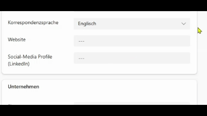

# nx-d365-pp-PCF-CsvDropdown

## Overview

A PCF control that renders a dropdown populated from a semicolon-separated list of values.
Optionally the user can enter a custom free-text value.

## Configuration

| Property | Type | Required | Description |
| --- | --- | --- | --- |
| Field | Bound field | Yes | The data field the selected value is written to (supports `Whole.None`, `Currency`, `FP`, `Decimal`, `SingleLine.Text`). |
| CSV Values | `SingleLine.Text` | Yes | Values separated by `;` that are displayed as dropdown options. |
| Allow Custom Value | `TwoOptions` | Yes | When set to **Yes**, a "Benutzerdefiniert…" option is appended to the dropdown that lets the user type a free-text value. |
| Custom Value Label | `SingleLine.Text` | No | Overrides the default label "Benutzerdefiniert…" shown for the custom-value option. |

## Features

- Populate a dropdown from a configurable semicolon-separated value list
- Optional free-text input via the "Benutzerdefiniert…" option (configurable label)
- Respects field-level security (disabled state) and required-field metadata
- Styled to match the native Model Driven App (Unified Interface) dropdown

## Preview



## Development

### Prerequisites

- [Node.js](https://nodejs.org/) (LTS)
- [Power Platform CLI](https://learn.microsoft.com/en-us/power-platform/developer/cli/introduction) (`pac`)

### Setup

1. **Power Platform CLI Authentication**:

   ```bash
   pac auth create --environment <Environment Url>
   ```

2. **Install**:

   ```bash
   npm install
   ```

### Build and Deployment

1. **Lokaler Build**:

   ```bash
   npm run build
   ```

2. **Deploy control to environment**:

   ```bash
   pac pcf push --incremental --publisher-prefix nx
   ```

### Debugging

1. **Start test Harness**:

   ```bash
   npm start
   ```

2. **Watch mode für continuous development**:

   ```bash
   npm start watch
   ```

## Build the Power Platform solution

### Build the control

From the root folder

cd CsvDropdownPCF

npm install

npm run build

cd ..

### Build the Solution

`msbuild Solution\Solution.cdsproj /restore /t:rebuild /p:Configuration=Release`
